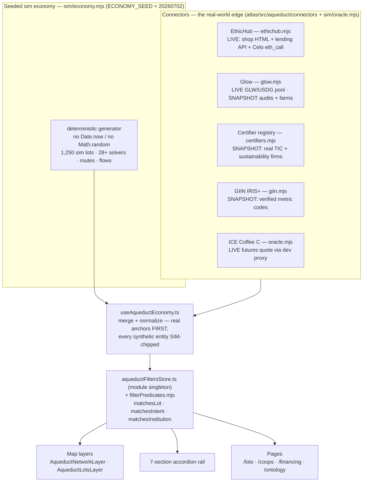

# AqueductX — system architecture

This document describes what the code does today, not what it aspires to. Every claim below
cites a path you can open. Where a capability is simulated, prepared-but-unbroadcast, or
snapshotted rather than live, it says so — that honesty is itself an architectural layer
(§4). Two companion research docs carry the arguments this file only summarizes:
[`docs/research/12-value-chain-and-swarm-thesis.md`](research/12-value-chain-and-swarm-thesis.md)
(the REA data model) and
[`docs/research/13-privacy-and-swarm-coordination.md`](research/13-privacy-and-swarm-coordination.md)
(the privacy posture).

AqueductX is a swarm decision-support system for agricultural trade finance: a set of small,
single-purpose agents that **aggregate** proof, **verify** it, **price** it, **publish** an
intent, let solvers **fill** it, and prepare the **settle** leg — feeding a capital-allocation
decision a human or institution still owns. It is not a marketplace and does not sit between
farmer and counterparty.

## 1. The loop, and which agent role owns each step

The whole product is one ordered cascade, assembled per lot as a pure, replayable function in
[`atlas/src/aqueduct/sim/cascade.mjs`](../atlas/src/aqueduct/sim/cascade.mjs) (`buildCascade`,
scout → diligence → oracle → intent → solver race → buyer match → settle → vault).

| Step | Agent role | Where it lives | What it actually does |
|---|---|---|---|
| **Aggregate** | scout | `connectors/ethichub.mjs`, `connectors/glow.mjs`, seeded scouts in `sim/economy.mjs` | EthicHub scout reads three public surfaces — the Odoo shop HTML, the lending JSON API, and a Celo `CreditLine` `eth_call` (`ethichub.mjs:19-22`). Glow scout reads `glow.org/api/audits`. Sim scouts pin the 1,250 seeded synthetic lots (870 coffee / 245 cacao / 135 honey); with the 3 real EthicHub anchors that is 1,253 coffee/sim lots, and the 10 Glow solar farms bring the Lots rail to 1,263 across two verticals (`Explore.tsx:517-530`). |
| **Verify** | diligence | `state/filterPredicates.mjs`, `sim/standardsRegistry.mjs` + the connectors it fans to | EUDR readiness is derived from three evidence booleans (`deriveEudrStatus`, `filterPredicates.mjs:27`) — status, never geometry (§7). The **certifier registry is the standards axis**: `standardsRegistry.mjs` maps a citation `source` to exactly one resolver — `CERTIFIER` → real TIC/sustainability firms (`certifiers.mjs`), `GLOW-GCA` → Glow solar audits (`glow.mjs:251`), `GIIN-IRIS+` → verified IRIS+ metric codes (`giin.mjs`). |
| **Price** | oracle | `sim/oracle.mjs`, `connectors/glow.mjs` | Two-register floor: a LIVE ICE Coffee "C" front-month quote (KC=F via a dev-proxy, `oracle.mjs:24`) plus a named, sourced Chiapas differential tagged `ESTIMATE`, degrading to a dated SNAPSHOT on any fetch failure — never a bare C-quote. Glow's GLW price is a live UniV2 pool read; its GCC register is honestly reported degenerate (`getGccOracleState`, `glow.mjs:294`). |
| **Publish** | intent | `hooks/useAqueductEconomy.ts`, `sim/financeIntent.mjs` | Three Commitment kinds are emitted: `sell-this-lot`, `finance-this-planting`, `finance-this-farm` (`useAqueductEconomy.ts:174-235`). The finance intents carry a Kiva-template ask line and a typed Claim (§5). |
| **Fill** | solver + tokenizer | `sim/solverRoster.mjs`, `routes/engine/services/commodity-landed-cost.mjs`, `sim/tokenizerRoster.mjs` | Solvers compete on **landed cost** to move a physical lot; the open reference/backstop solver's bid is a *real* computation from the Routes engine at call time (`commodity-landed-cost.mjs:106` — deterministic, itemized, per-line confidence, never `price±random`). Tokenizers compete on **structuring terms** to turn an investable into a tradable instrument (`tokenizerRoster.mjs:186`), the same race pattern applied to a different question. |
| **Settle** | settle | `hooks/useRealVsSimSummary.ts`, `components/RealVsSimNotice.tsx` | A `sell-this-lot` intent is prepared against the deployed IntentRegistry on Base Sepolia (§8). Prepared, env-var-gated, surfaced in the header dev bar — not silently broadcast. |

## 2. Data flow

Connectors reach the real world; the seeded economy fills the rest at scale; one hook
normalizes both into one shape; one singleton store with one predicate module feeds three
independent UI consumers.



**The one-predicate / three-consumers invariant.** `state/filterPredicates.mjs` is plain ESM
(no test runner exists, so `node script.mjs` must import it directly). `aqueductFiltersStore.ts`
imports and re-exports those same predicates rather than reimplementing them
(`aqueductFiltersStore.ts:3,143`); the map layers (`AqueductNetworkLayer.tsx:9`), the rail, and
the pages all read the same singleton via `useAqueductFilters` (`useSyncExternalStore`, no React
context). Because filtering lives in one module with three readers, the map count, the rail
count, and the bar count cannot disagree.

## 3. Normalization contract (`useAqueductEconomy.ts`)

One hook is the single assembly point. It merges the real EthicHub anchors (loaded snapshot-first
by `useAqueductLots.ts`, best-effort live re-fetch) ahead of the seeded economy, stamps
`commodity: "coffee"` onto raw real rows, folds `ledger.json`'s real per-event source URLs into
the event stream (parsing the ISO `ts` to epoch-ms before a numeric sort — the latent NaN-sort
bug of the old ledger page is not reproduced, `useAqueductEconomy.ts:347-377`), and returns typed
arrays: `lots`, `realLots`, `intents`, `actors`, `events`, `flows`, `hubs`, `coops`, `routes`.
The AqueductX types it exports (`AqueductAnyLot`, `AqueductActor`, `AqueductIntent`,
`AqueductEvent`, and the `AqueductFinanceClaim` union) are the labeled REA model of §5.

## 4. Provenance discipline as an architectural layer

Every rendered element carries a provenance chip — `LIVE / SNAPSHOT / SIM / TESTNET / TO-BUILD`
(`components/Chips.tsx:3`) — on one axis, and a confidence tag — `confirmed / reported / estimate`
— on the other. The chip answers *where the data came from*; the tag answers *how sure the
number is*. This is not decoration; it is enforced at the source:

- Connectors are **curated snapshots of individually-verified records, never guessed from
  training recall** — `certifiers.mjs`, `giin.mjs`, and `glow.mjs` each carry a `verifiedAt`
  date and the real source URL, and each `resolve*` throws on an unknown id rather than
  inventing one (`certifiers.mjs:108`, `glow.mjs:251`).
- `lot.certs` is left empty because no real source populates it — a policy citing it honestly
  flags "no certification on file" rather than being fed an invented pass (`certifiers.mjs:20-24`).
- The Glow GCC price register is reported as degenerate (drained auction, dust pool) instead of
  fabricating a number (`glow.mjs:291-311`). The Miner terms are graded `reported`, never
  `confirmed`, because the listing is auth-gated (`glow.mjs:317`).
- The seeded economy is deterministic — one seed (`ECONOMY_SEED = 20260702`), no `Date.now`, no
  `Math.random` — so it replays identically and is labeled `SIM` at every appearance
  (`economy.mjs:1-16`).

The operating rule: **never a capability shown live that isn't.** A real EUDR check that finds
real gaps renders `PARTIAL`; the gap is the credibility.

## 5. The REA data model (compact — argument in doc 12)

AqueductX's types were already an unlabeled REA (Resource–Event–Agent; McCarthy 1982,
operationalized by Valueflows) model. Labeling it turned "map the value chain" into schema
decisions — and surfaced one object the base ontology was missing entirely: the **Claim**.

| REA concept | AqueductX type | Note |
|---|---|---|
| Economic Resource | `AqueductAnyLot` | A lot: commodity, weight, price, EUDR evidence. Finance intents now type their *inputs* too (`inputResource: {resourceType, quantity, unit}` — seedlings, solar fractions). |
| Agent | `AqueductActor` + hubs | coop / venue / solver / infrastructure, plus demand hubs wrapped `kind:"hub"` at the selector (`filterPredicates.mjs:138`). |
| Commitment | `AqueductIntent` | The three intent kinds; they differ only in *which side is deferred*. |
| Economic Event | `AqueductEvent` | The feed, merged with `ledger.json`'s real source URLs. |
| **Claim** | `AqueductFinanceClaim` = `EthicHubClaim \| GlowClaim` | **The load-bearing addition.** |

A `sell-this-lot` intent is a near-spot reciprocal exchange — lot for capital, roughly
concurrent, no future obligation, no Claim. A `finance-*` intent is not: capital moves now,
repayment happens later, at a rate and term — REA's deferred half, the Claim. The two Claim
shapes are deliberately *not* unified (`useAqueductEconomy.ts:26-48`): EUR/APR/months (a
conventional EthicHub / Heifer facility credit line, real cited ceiling **9.9%**) versus USD/token-stream/weeks (a
Glow GLW delegation) are different instruments, and forcing one record would misrepresent one of
them. This is why the two finance kinds are the same *species*, not two ad hoc features.

## 6. Two verticals, one loop

The same aggregate → verify → price → publish → fill → settle loop runs over two commodities —
"one settled over oceans, one over wires."

- **Coffee corridor** (the anchor). Real EthicHub Chiapas lots are LIVE/SNAPSHOT reads; the
  oracle floor is a real ICE C quote; the backstop solver's bid is a real landed-cost
  computation; endogenous credit at the anchor coop is REAL (EthicHub's Celo USDC credit lines,
  Line 2's completed 192,600 → 212,369.79 USDC cycle). Fills across the synthetic economy are
  SIM; the settle leg is prepared TESTNET.
- **Glow solar spine** (`connectors/glow.mjs`, `sim/financeIntent.mjs:131`). Farm = lot, GCA
  audit = the certifier role, GLW/GCC = oracle registers, a Miner (a fractional claim on a
  farm's reward stream) = the structured receivable the tokenizer race sims. **Honesty boundary
  per channel:** farm audits, GLW price, and Miner terms are real reads (SNAPSHOT/reported);
  the GCC price register is reported unusable; **fills stay SIM** until Glow publishes V2
  onchain delegation/Miner-purchase addresses (`financeIntent.mjs:166-191`).

## 7. Privacy posture (link doc 13)

The map renders EUDR *status* (ready / partial / gap) and never plot geometry, and lots carry
`title_redacted` (initials-only). This was an instinct in the code; doc 13 names it **policy**:
AqueductX renders compliance status, attestations, and aggregates — never plot polygons, never
full names. The load-bearing finding is that EUDR does not require polygons to be public (they
go into the DDS via TRACES, seen only by competent authorities); the exposure is public maps
rendering them, a self-inflicted wound this layer declines. Glow farm coordinates are different
in kind — Glow publishes them itself as protocol design, and the chip carries that fact. The
labeled roadmap: certifier attestation objects (VC/BBS+, TO-BUILD), sealed-bid solver races
(Interfold/MACI, TO-BUILD), cross-coop private aggregates (research-stage). Nothing in the
current UI claims any of these as built.

## 8. Settlement

A `sell-this-lot` intent is prepared as a settle payload against the deployed IntentRegistry on
**Base Sepolia** (`/data/aqueduct/settle-payload.json`, typed at `useRealVsSimSummary.ts:9-15`:
`lot_id`, `tx_hash`, `explorer_url`, `expected_env_var`). The payload is real (chain, calldata,
args) but **env-var gated** — broadcast requires `AQUEDUCT_SETTLE_PRIVATE_KEY`; absent it, the
dev bar shows "awaiting broadcast". `useRealVsSimSummary` is the sole fetch of the payload, and
`RealVsSimNotice` surfaces it in the header's dev-mode bar (there is no separate ledger page).
The chip is `TESTNET`: prepared against a deployed contract, real when broadcast.

## 9. Where things live

```
atlas/src/aqueduct/
  connectors/     ethichub.mjs · glow.mjs · certifiers.mjs · giin.mjs · buildAnchorLots.mjs
  sim/            economy.mjs (seed 20260702) · cascade.mjs · oracle.mjs · financeIntent.mjs
                  solverRoster.mjs · tokenizerRoster.mjs · standardsRegistry.mjs
                  institutionPolicies.mjs · policy.mjs · tradeFinance.mjs · venues.mjs
  state/          aqueductFiltersStore.ts (singleton) · filterPredicates.mjs · tourStore.ts
  hooks/          useAqueductEconomy.ts · useAqueductLots.ts · useRealVsSimSummary.ts
  components/     AqueductNetworkLayer · AqueductLotsLayer · Chips · RealVsSimNotice · ...
  pages/          AqueductLotDetails · AqueductCoopSeat · AqueductFinancing
                  AqueductMapGuide (/guide) · AqueductOntology (/ontology)
routes/engine/services/
  commodity-landed-cost.mjs   the real, shared, deterministic landed-cost engine
```

The `/guide` page documents the map's visual language; the `/ontology` page documents this data
model as a living surface, rendering a real lot, intent, Claim, and event straight from
`useAqueductEconomy`.
</content>
</invoke>
